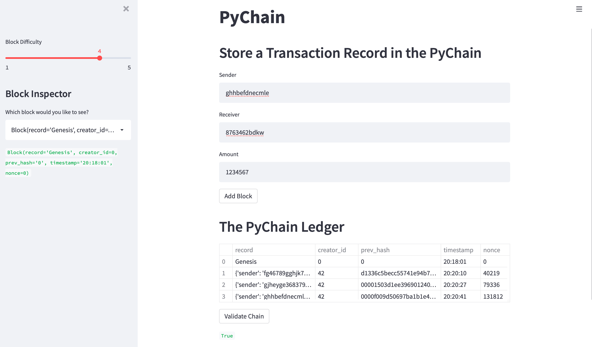

# PyChain Ledger

This assignment project is about me on a role of a fintech specialist. I was given a task to build a blockchain ledger system and complete with a user friendly interface This ledger should allow partner banks to transfer money between senders and receivers.

## Libraries
* streamlit
* dataclass
* typing
* datetime
* pandas
* hashlib

## Package Requirements and Versions

pip install x ; where 'x' is the package listed below:
* python == 3.7.13+
* pandas == 1.3.5+
* streamlit == 1.13.0+

## PyChain Streamlit Web Interface Screenshot

